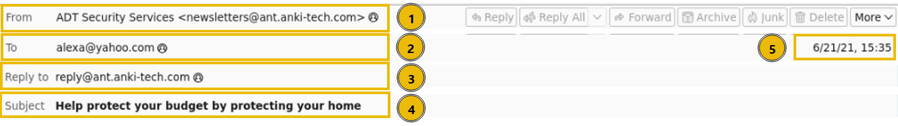
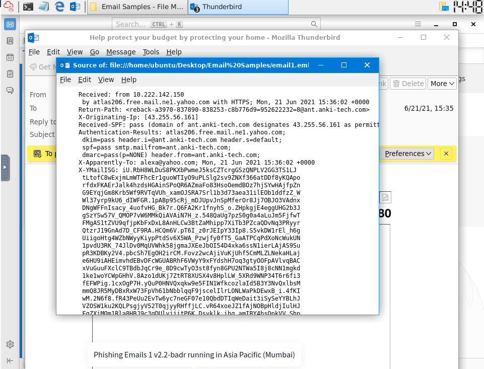
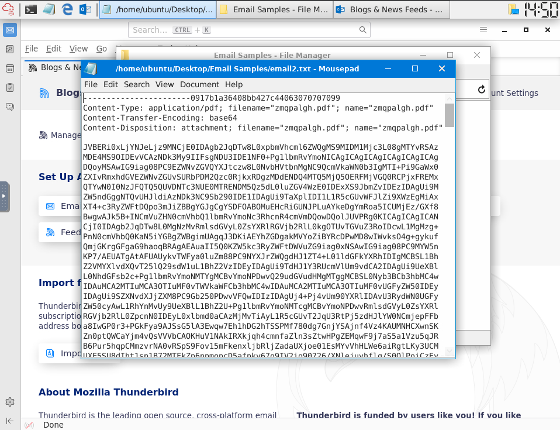
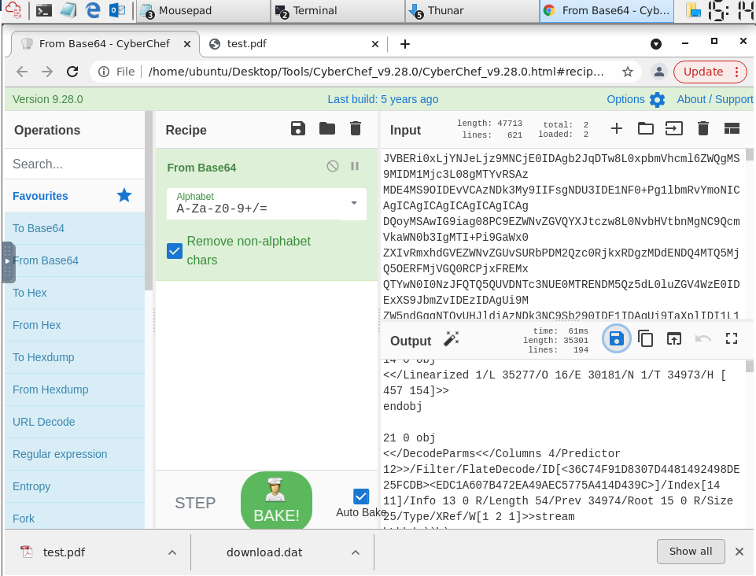
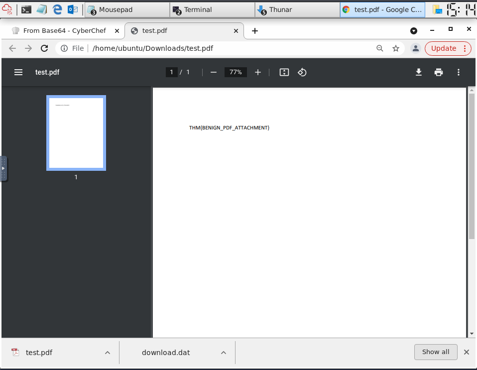
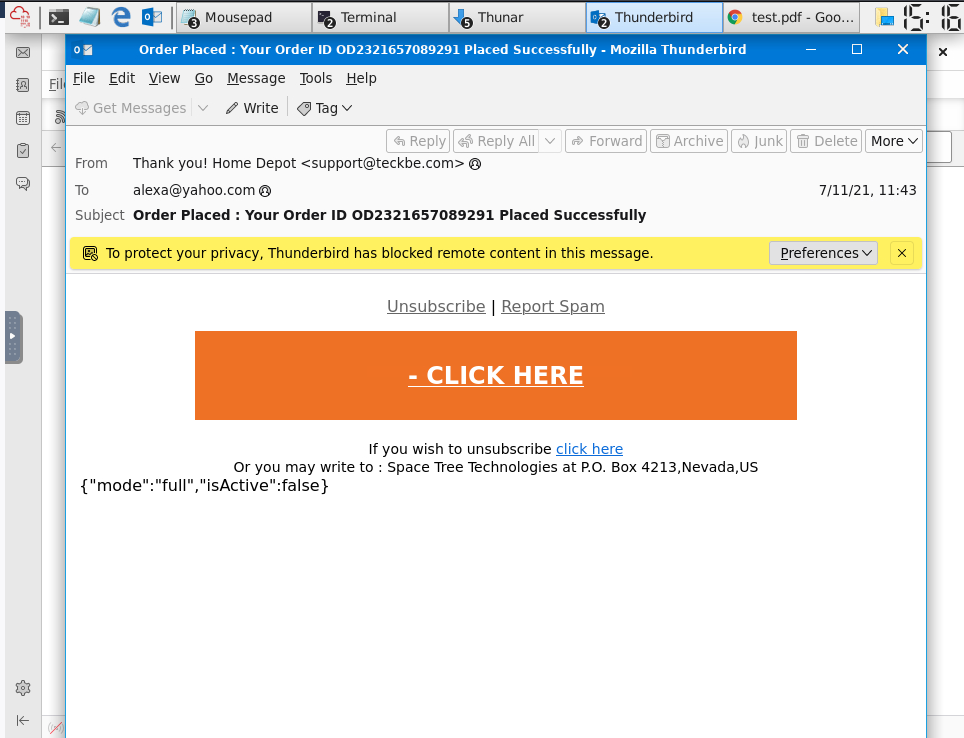
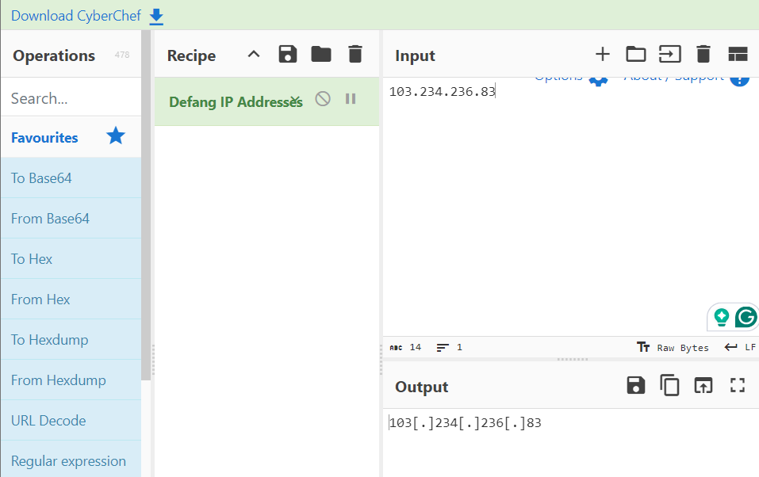
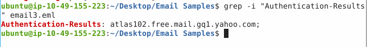

# TryHackMe: Phishing Analysis Fundamentals Walkthrough

## Task 2: The Email Address

### Q1: Identify the domain used in the following email address: hatsalesman@tryhatme.com <br>

Answer: tryhatme.com <br>
Explanation: 
1. An email address is split into two parts by the @ symbol. Everything before the @ is the username, and everything after it is the domain.
2. For the address hatsalesman@tryhatme.com, look past the @ symbol to extract the domain name.

## Task 3: Email Delivery

### Q1: Which protocol is responsible for sending an email from a client to a mail server?

Answer: SMTP <br>
Explanation: The reading text states that when a user sends an email, the client sends the message to the mail server using SMTP (Simple Mail Transfer Protocol). It is the only protocol in the list dedicated to outbound mail delivery.

### Q2: Which service is used to look up the recipient domain’s mail server?

Answer: DNS <br>
Explanation: According to the step-by-step breakdown of an email's journey, the sending mail server queries DNS (Domain Name System) to discover the address of the recipient domain's mail server.

### Q3: Bob wants to access his email from multiple devices, including his phone and laptop. Which protocol should he use?

Answer: IMAP <br>
Explanation: The text highlights that IMAP stores emails directly on the server and syncs messages across multiple devices. POP3 downloads messages to a single device and deletes them from the server, making multi-device access impossible.

## Task 4: Email Headers



### Q1: What is the full subject line of email1.eml?

Answer: Help protect your budget by protecting your home <br>
Explanation: By looking at the provided screenshot of the email client headers, item 4 points directly to the Subject field. The full text written inside that highlighted box is "Help protect your budget by protecting your home".

### Q2: View the message source of email1.eml using Thunderbird in your VM. What the IP address listed as the X-Originating-Ip?



Answer: 43.255.56.161 <br>
Explanation: The raw message source window of email1.eml shows the full email metadata headers. Scanning down to the fourth line of the text block reveals the X-Originating-Ip: header, which explicitly lists the IP address inside the brackets as 43.255.56.161.

2. Extract the raw numerical IP address listed on that line.

## Task 5: Email Body



### Q1: Open up the email2.txt file to view the source of an attachment. What is the Content-Type of the attachment?

Answer: application/pdf <br>
Explanation: Looking at the top lines of the open text file window for email2.txt, the metadata clearly lists Content-Type: application/pdf on the second line.

### Q2: What is the name of the attachment from the previous question?

Answer: zmqpalgh.pdf <br>
Explanation: In the same text window for email2.txt, the file headers include a filename= parameter on both the second and fourth lines. Reading the text inside the quotation marks explicitly reveals the name as zmqpalgh.pdf.

### Q3: Decode the base64 string using either a PDF converter (opens in new tab) or CyberChef (opens in new tab). What is the hidden flag value?

Answer: THM{BENIGN_PDF_ATTACHMENT} <br>
Explanation:




1. Open email2.txt and copy the large block of alphanumeric characters representing the Base64 payload.
2. Paste the text block into the input section of CyberChef and add the From Base4 recipe.
3. Click the disk icon to download the decoded output, manually naming the file test.pdf.
4. Open the PDF file to find the printed flag.

## Task 6: Type of Phishing



### Q1: Which reputable organization is being spoofed in this phishing attempt?

Answer: Home Depot <br>
Explanation: Looking at the email header in email3.eml, the display name in the From field explicitly says "Thank you! Home Depot", showing that the attacker is trying to impersonate the Home Depot brand.

### Q2: What is the sender's email address?

Answer: support@teckbe.com <br>
Explanation: In email3.eml, looking past the fake display name in the From header reveals the actual email address, support@teckbe.com, hidden inside the angle brackets < >.

### Q3: Inspect the email message source. What is the defanged X-Originating-IP?



Answer: 103[.]234[.]236[.]83 <br>
Explanation: Copy the IP address of X-Originating-Ip listed in the message source for email3.eml and decode it using the Defang IP Address recipe in CyberChef.

### Q4: Continue analyzing the email message source. Which mail server generated the Authentication-Results header?



Answer: atlas102.free.mail.gq1.yahoo.com <br>
Explanation: 

```
grep -i "Authentication-Results" email3.eml
```

The output directly displays the mail server responsible for generating the authentication results right after the header label.

